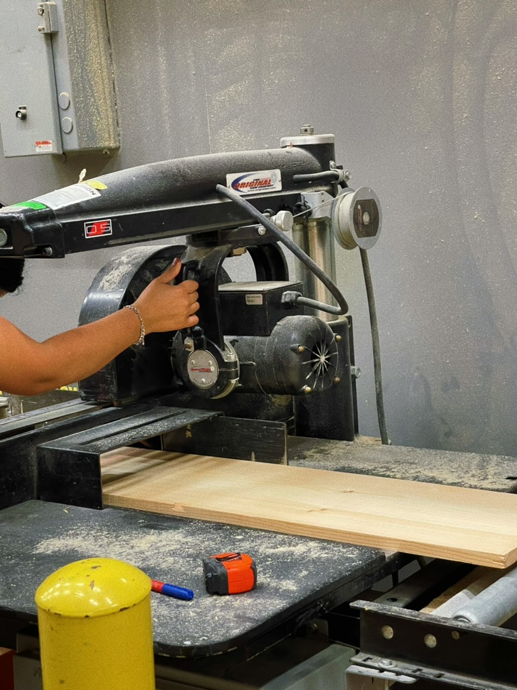
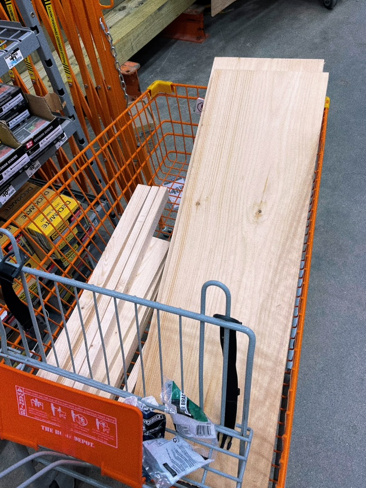
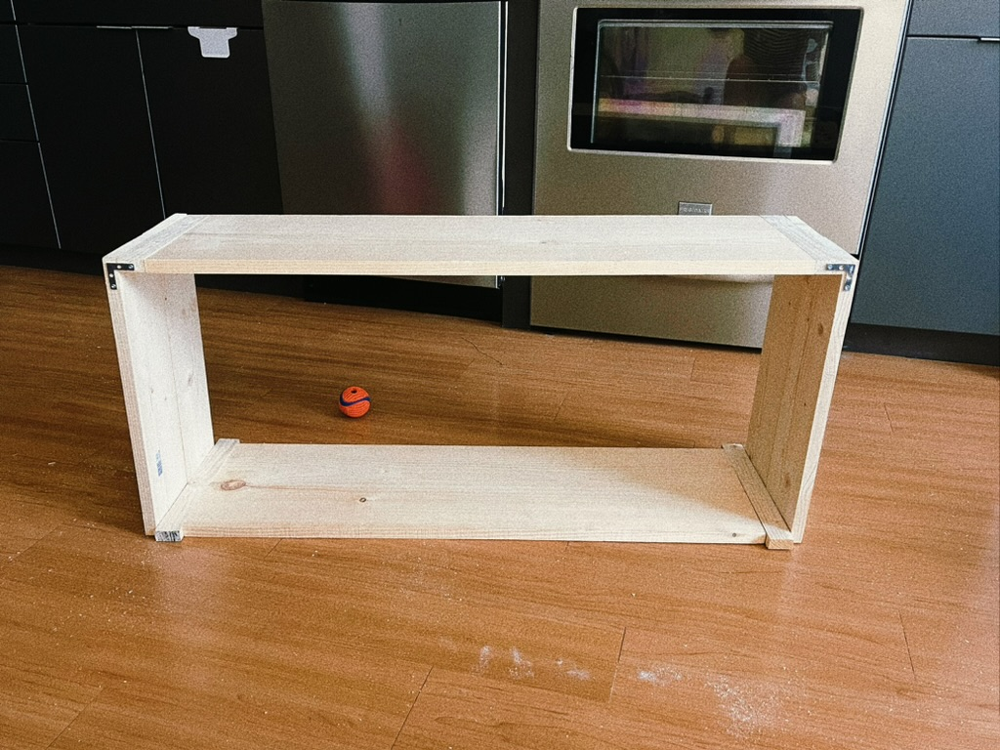
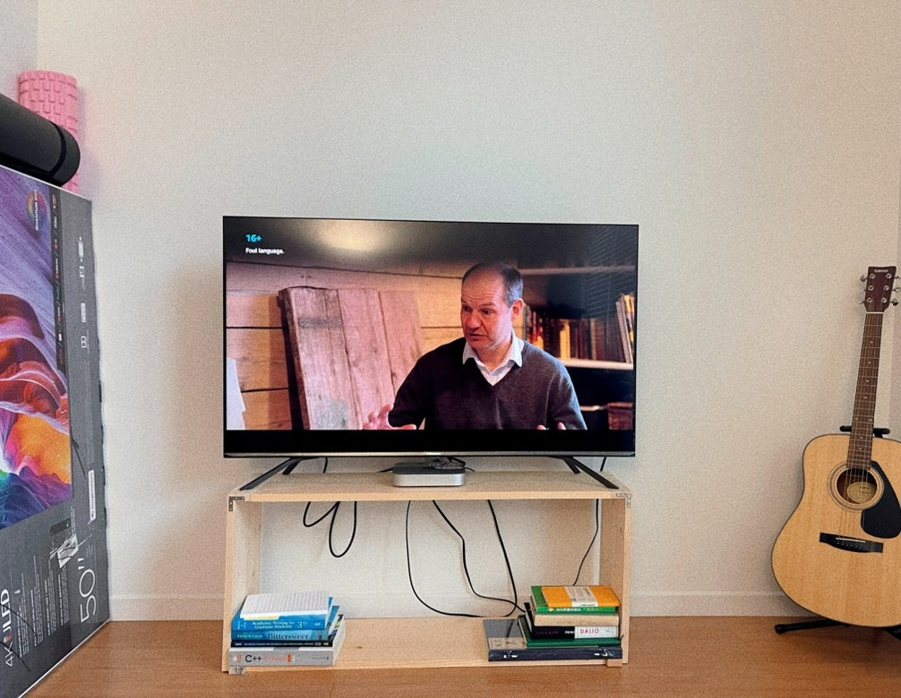

Figure 1: Home Depot Wood Cutting

Figure 2: Home Depot Wood Cutting

Figure 3: Final Product

Figure 4: Final Product with the TV on it

---------------------------------------------------------------------------------------

## Price Chart

| ITEM                               | COUNT | TOTAL PRICE | UNIT PRICE |
|------------------------------------|-------|-------------|------------|
| HOME DEPOT                         |       |             |            |
| 1X12-6FT COMMON BOARD              | 1     | 17.21       | 17.21      |
| 1X2-4FT COMMON BOARD               | 2     | 3.82        | 1.91       |
| WOOD SCRW ZINC PHL OVAL #6 X 1-3/4 | 2     | 2.76        | 1.38       |
| BRACE, CORNER 1" ZINC 4PK          | 2     | 5.94        | 2.97       |
| WOOD SCRW ZINC PHL FLT #6 X 3/4    | 1     | 1.38        | 1.38       |
| 1X6-6FT COMMON BOARD               | 1     | 8.58        | 8.58       |
| ABORN TRUE VALUE                   |       |             |            |
| NUTS BOLTS 6 X 1-1/2               | 8     | 2.8         | 0.35       |
| 1-1/2 CONRNER IRON                 | 1     | 4.39        | 4.39       |
| 6PC HEX SHANK BIT SET              | 1     | 24.99       | 24.99      |
| NUTS BOLTS 8 X 2-1/2               | 10    | 7.9         | 0.79       |
| MM KEYHOLE SAW                     | 1     | 9.99        | 9.99       |
| 4PK 1X1/2 CORNER IRON              | 1     | 4.99        | 4.99       |
| 4PK 2X1/2 MENDING PLATE            | 1     | 5.69        | 5.69       |
| MED PVC DOT COTT GLOVE             | 1     | 3.49        | 3.49       |
| 80G SPON BLOCK                     | 1     | 5.99        | 5.99       |
|                                    |       |             |            |
| HOME DEPOT TOTAL                   |       | 39.69       |            |
| TOTAL COST                         |       | 70.46       |            |
